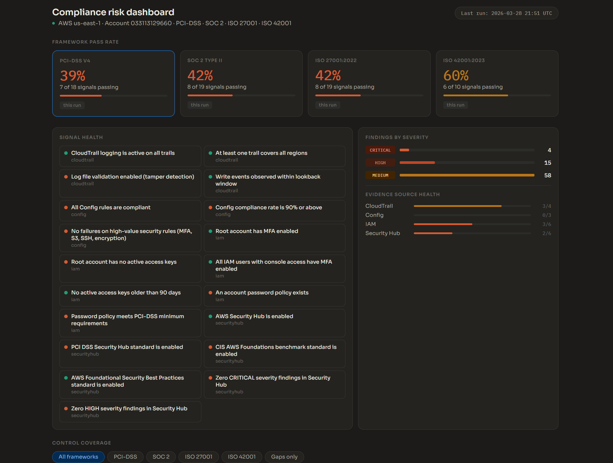

# AWS Compliance as Code

Automated compliance evidence collection for AWS, mapped to four frameworks
simultaneously: PCI-DSS v4, SOC 2 Type II, ISO 27001:2022, and ISO 42001:2023.

Instead of collecting evidence manually before an audit, this runs every week
on a schedule. It queries your AWS environment, evaluates each control, commits
the results to git as a timestamped audit trail, and opens a GitHub Issue for
every failing control with the affected resource and a remediation step.

The output is three CSV reports, a stakeholder-ready HTML dashboard, and a
formatted Word audit report -- all generated automatically from the same
evidence collection run.

## Sample outputs

---
